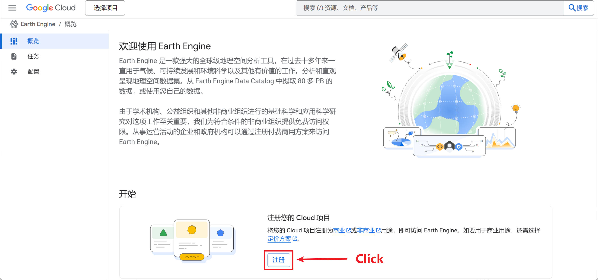
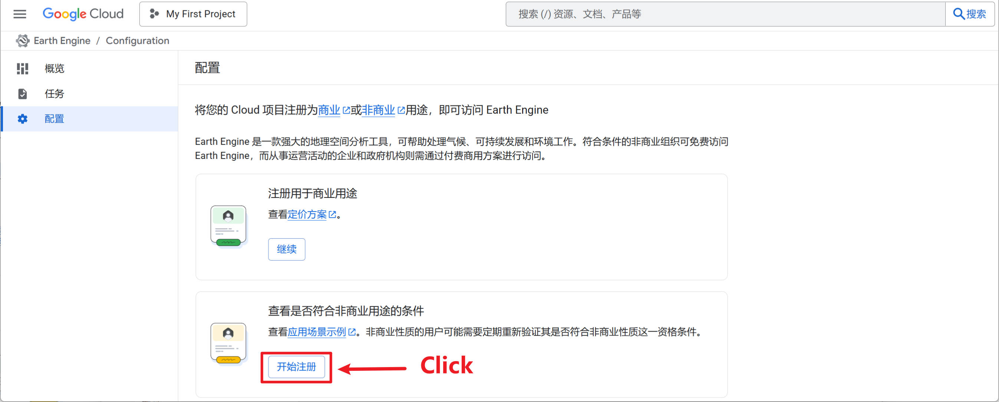
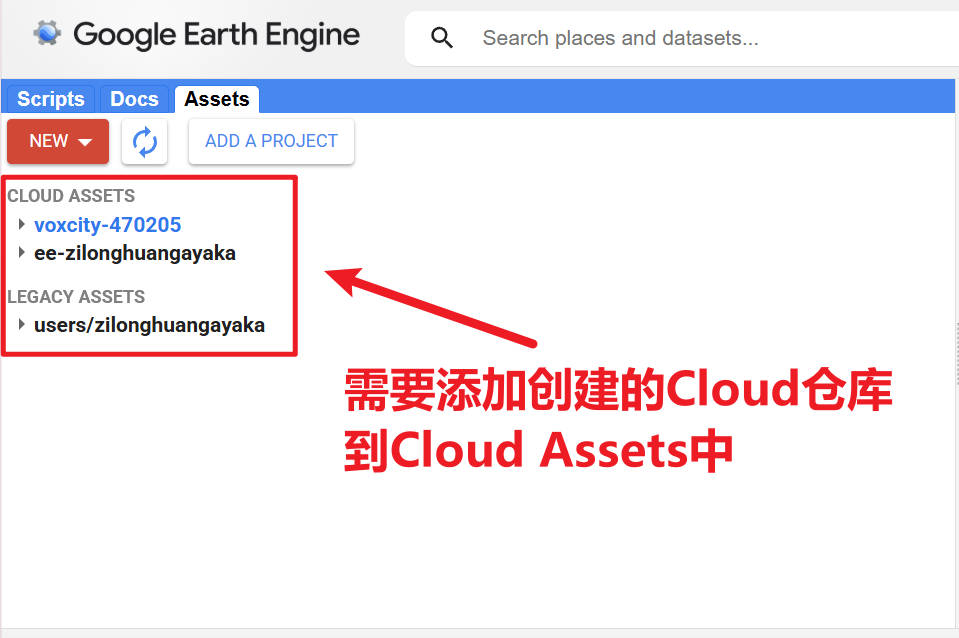
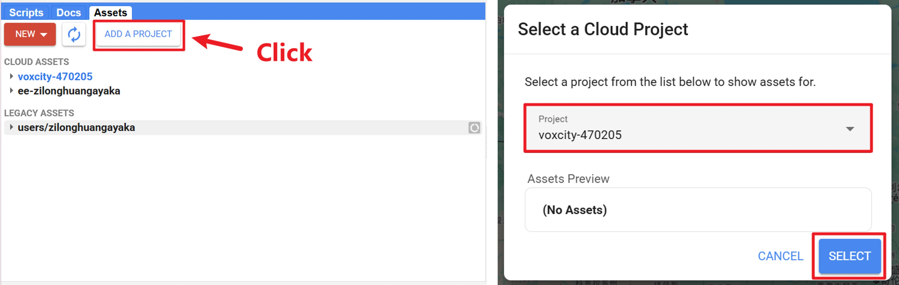
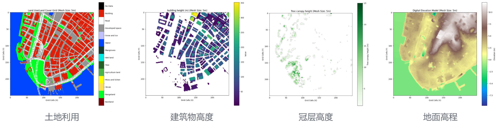

## Introduction

最近干起了跟GIS相关的任务，正好前段时间[Filip Biljecki](https://scholar.google.com/citations?user=jGqm4kEAAAAJ&hl=zh-CN)来学校开了个讲座，发现他做的东西还是蛮有意思的。之前虽然看过他几篇文章，但是通过这次讲座才知道他还有那么多别的方向的paper。于是在讲座后，我去读了下他的一些文章，发现有一篇文章 [VoxCity: A Seamless Framework for Open Geospatial Data Integration, Grid-Based Semantic 3D City Model Generation, and Urban Environment Simulation](https://arxiv.org/abs/2504.13934) 做的东西非常有趣，且里面做的东西我是用得上的。于是我按照 [VoxCity github](https://github.com/kunifujiwara/VoxCity) 配置了环境，试着跑了代码。但是过程中还是遇到了不少问题的，因此写个博客记录一下。

## Setup for Earth Engine

对于本地的环境部署，仅需要参考README中的**Installation**部分进行配置即可，基本不会存在什么问题。在完成了环境的配置后，就需要对Earth Engine的环境进行配置了。

```bash
git clone https://github.com/kunifujiwara/VoxCity.git
conda create --name voxcity python=3.12
conda activate voxcity
conda install -c conda-forge gdal
pip install voxcity
```

### 1. Download gcloud package

在我按照环境配置后，我运行脚本发现出现了以下报错：

```shell
Exception: gcloud command not found. Please ensure that gcloud is installed.
More information: https://developers.google.com/earth-engine/guides/auth
```

这意味着经过上面的环境配置，并没有配置好 `gcloud` 的环境。因此，需要去 [gcloud CLI安装指南](https://cloud.google.com/sdk/docs/install?hl=zh-cn#linux) 按照对应的步骤进行 `gcloud` 的安装。

### 2. Authenticate and initialize Earth Engine

在完成了 `gcloud` 的配置后，接下来就可以在命令行部分运行 `earthengine authenticate`，按照命令行的提示进行 Earth Engine的 authenticate 即可。在完成配置后，可以在命令行再一次输入 `earthengine authenticate`，如果得到 `Authenticate: Credentials already exist.  Use --force to refresh.` 的输出说明已经正确配置成功了。

### 3. Register Cloud project

在注册Cloud项目前，最好有一个Google的账号，便可以直接进行登录。在登录后，前往 [Cloud 注册页面](https://console.cloud.google.com/earth-engine/welcome?hl=zh-cn) ，在**概览**部分点击注册按钮进行Cloud项目的注册。



点击后会进入到**配置**界面，根据需要选择对应的用途。这里由于本人是学生，因此我选择了**非商业用途**，后续只需要根据要求依次填写对应的信息即可。



### 4. Create new project

在完成后即可在 [IAM](https://console.cloud.google.com/iam-admin/iam) 部分选择新建一个新的项目，这里我创建了名为 `voxcity` 的project。同时，需要保证在本地配置的用户信息在该项目中有权限进行访问（在IAM的对应project页面可以对用户访问权限进行控制）。


此处的project将作为下面的**Initialize**的参数。

```python
import ee
ee.Authenticate()
ee.Initialize(project='your-project-id')
```

需要注意的是，此处project应该填写的是 **ID** 部分的信息，即 `voxcity-470205`，而非 `voxcity`。否则可能出现以下的报错：

```shell
ee.ee_exception.EEException: Caller does not have required permission to use project voxcity. Grant the caller the roles/serviceusage.serviceUsageConsumer role, or a custom role with the serviceusage.services.use permission, by visiting https://console.developers.google.com/iam-admin/iam/project?project=voxcity and then retry. Propagation of the new permission may take a few minutes.
```

此外，为了能够通过 Cloud project 使用 GEE API，需要去 [GEE API页面](https://console.cloud.google.com/apis/api/earthengine.googleapis.com/metrics) 确保新建project的GEE API进行了正确的配置，否则在使用的过程中可能会出现API接口无法访问的情况。

### 5. Download data from GEE

如果上面的过程均正常完成，那么便可以通过GEE API进行数据下载了。以VoxCity的代码为例，在运行`get_voxcity()`函数时，会进行数据的下载。

```python
voxcity_grid, building_height_grid, building_min_height_grid, building_id_grid, canopy_height_grid, canopy_bottom_height_grid, land_cover_grid, dem_grid, building_gdf = get_voxcity(
    rectangle_vertices,
    building_source,
    land_cover_source,
    canopy_height_source,
    dem_source,
    meshsize,
    **kwargs
)
```

在数据下载的过程中，可能会出现下面的几个报错：

```shell
# Error 1
...
googleapiclient.errors.HttpError: <HttpError 404 when requesting https://earthengine.googleapis.com/v1/projects/voxcity-470205:listAssets?alt=json returned "Asset "projects/voxcity-470205/assets" not found.". Details: "Asset "projects/voxcity-470205/assets" not found.">

# Error 2
...
ee.ee_exception.EEException: Asset "projects/voxcity-470205/assets" not found.

# Error 3
ee.ee_exception.EEException: ee.Initialize: no project found. Call with project= or see http://goo.gle/ee-auth.
```

起初我并没有太理解为什么会出现这些报错，我以为是project权限的问题导致对应的assets文件夹无法进行访问。经过排查，最终发现，问题出在 [GEE平台](https://code.earthengine.google.com/) 上。由于起初并没有添加创建的 `voxcity-470205` project 到 cloud assets 中，导致了上面的报错。



因此，为了添加 `voxcity-470205` project 到 cloud assets中，仅需要点击 **ADD A PROJECT** 按钮，选择你需要添加的 Project 名称，最后点击 **Select** 即可完成正确的添加。这样就可以正常通过GEE API进行数据下载了。



下面是我运行VoxCity给的case区域下载得到的数据：



## Afterword 

GEE确实是一个非常不错的平台，做遥感类型的任务掌握GEE还是蛮重要的。之前对GEE的使用实在太少，使用仅限于在GEE Web平台上下载遥感影像数据。还是得好好学习一下，感觉还是非常有用的。