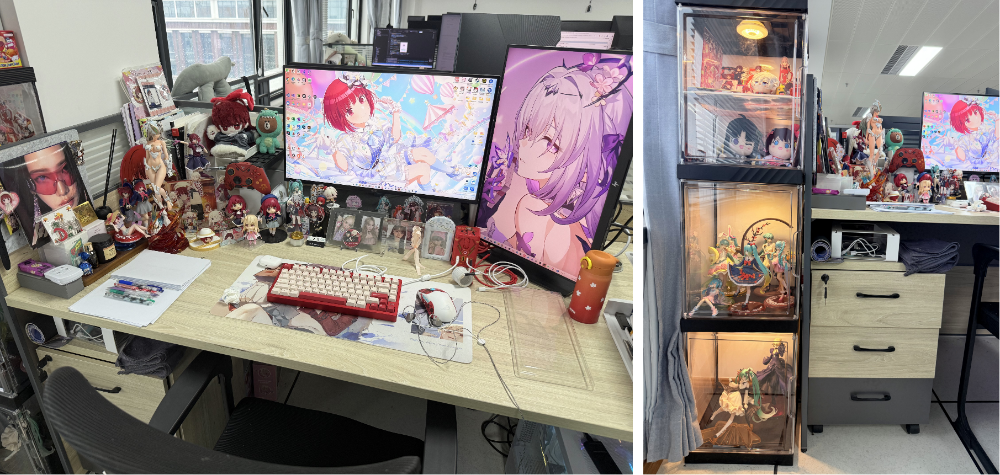
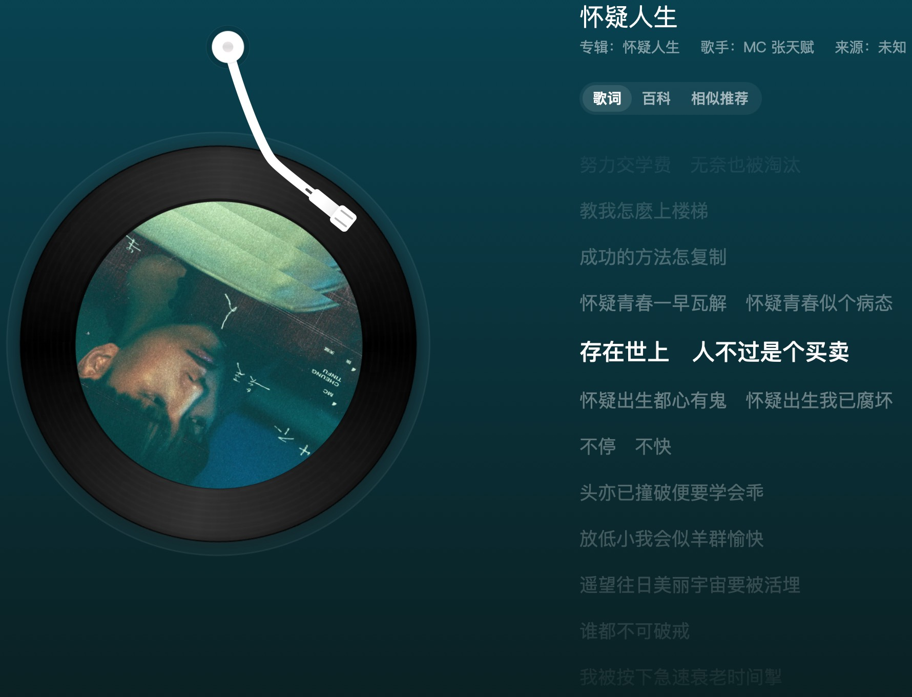
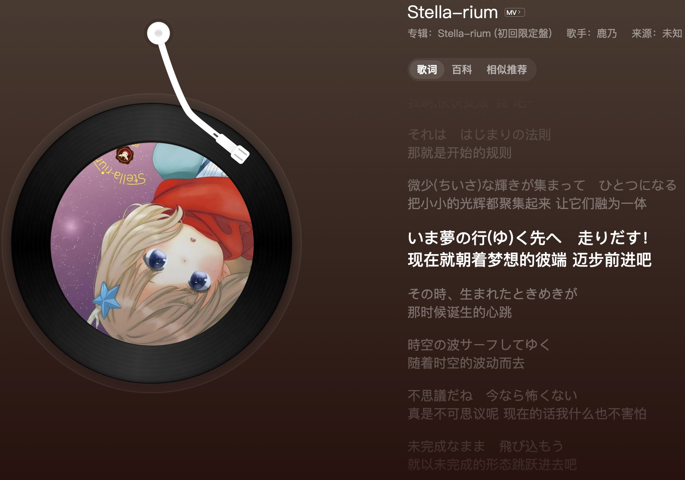
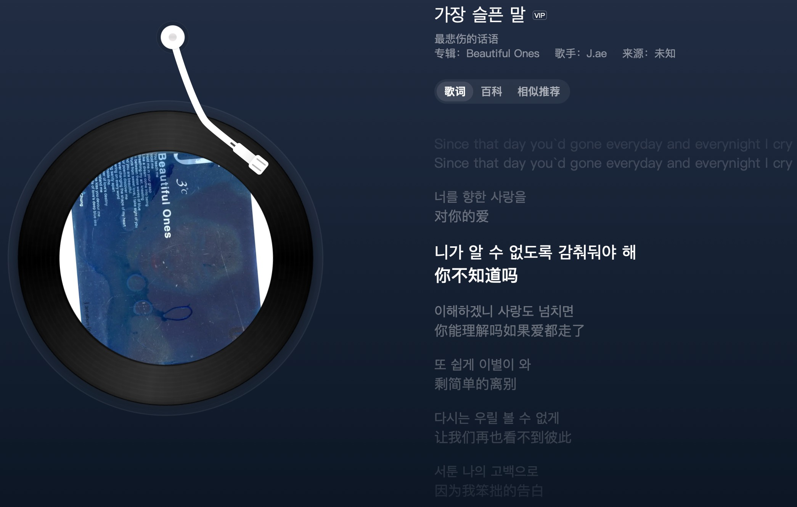

import VideoPlayer from '@/components/VideoPlayer.astro'

## 前言
> 2025.05.30 我终于有我自己的个人主页了！

从几年前起就一直想有一个自己的个人主页，但并不想跟别人一样只是套一个现成的模版，接着换成自己的文字介绍和图片，最后部署一下就当成自己的主页了，感觉太千篇一律了。可是受限于自己的水平有限，当时只会一点``html``、``css``，其他根本没咋学，完全不会做，加上当时对在 UE 做 NPR 渲染感兴趣，于是学习前端语言的计划就一直搁置了。但其实当时大三也做了一点有意思的东西的，比如下面的两个。

<VideoPlayer 
  src="https://www.bilibili.com/video/BV1jP411F7Hu/?vd_source=a104d05786111b546a2c03bc5f54f18e" 
  title="大三上 图形学课程大作业"
/>

<VideoPlayer 
  src="/videos/Grade3-Season3.mp4" 
  title="大三下 机器学习课程大作业"
/>

去年暑假期间，在科研之余重新复习了下``html``、``css``，顺便好好过了一遍``javascript``、学习了下``typescript``和``react``。当我以为可能也差不多的时候，发现``tailwind.css``也得学，``next.js``也得学。于是，在后续的时间中，时不时抽点时间来学习一下这方面的知识。终于在最近，看到了一个不错的模版，然后感觉可以拿来改成自己喜欢的样子，就开始着手做了。不过这个模版用了``astro``，中间也去小小的学了一点``astro``方面的知识。

过程中看了不少别人设计的主页，不得不感慨做前端设计的人是真的厉害啊，一个个做的是真的好看。从别人身上学习到了不少的设计思路，于是开始设计自己主页的排版样式，以及主题色系。

## 主页设计方案
> “Failing to plan is planning to fail.” —— Benjamin Franklin

### 布局

在排版布局方面，我主要是在主页面的地方进行了设计。由于Bento的设计兴起，我也是想着将主页面分割成多个模块，每个模块负责一个单独的功能展示。而为了尽可能让主页面更加丰富，我想将一些比较有意思的东西塞入进来，同时不要让页面太单调无趣。于是我参考了 [enscribe](https://enscribe.dev/) 的主页设计，这真的是我目前见到的最眼前一亮的主页，我的很多参考都是来自这个主页。非常感谢这个大佬做的主页！

基于上述的想法，我主要将模块分成了几个部分：
* 个人基本介绍
* 个人地理位置
* 个人技术栈
* 个人喜欢的角色分享
* 最新博客封面展示
* 页面背景音乐播放器
* 近7天的编程时间表统计
* 每日的编程活动表
* 有马佳奈的图片（夹带私货

### 主题色系

在主题色系方面，由于本人是女神异闻录的忠实粉丝，且 P3R 和 P5R 都通关了，对两款游戏的主题色系非常喜欢，特别是 P3R 那潮出水的UI设计简直太无敌了！两个主题色系正好可以符合 light 和 dark 两种情况，于是我就开始打算将 light 设计为蓝白色系， dark 设计为红黑色系。也算是满足下自己的私心了。

那么确认好布局、模块以及色系后，剩下的就是实现了。最终实现的就是当前效果了。当我开始做后我才发现，有马佳奈的衣服颜色和个人主题色正好是蓝色和红色，于是就设计了现在主页上的hover效果（即在鼠标没放在图片上时，显示图片对应主题色系下的信息，其他都是灰色。当鼠标hover到图片上时，显示完整的彩色图片），也是参考了绝区零的命座设计方式。

## 个人分享
> “The miracle is this: the more we share, the more we have.” —— Leonard Nimoy

### 工位

由于现在还是在读研究生，我主要就在**办公室**和**宿舍**进行办公。一般来说，科研的事情会在工位的PC做，开发类的事情会在宿舍的Mac Mini做（mac做开发确实舒服不少啊）。当然，我的办公室和宿舍的布置色系也是参考女神异闻录的，工位是P5R红色系，宿舍是P3R蓝色系。

下面的图就是我的**办公室工位**了。里面放了不少我喜欢的动漫角色周边（比如千束、佳奈、托帕等），也有一些KPOP的小卡（喜欢 aespa、itzy 和 kiss of life ，ive 的话主要吃 wonyoung 和 liz 的颜）。当然，作为无敌死宅，怎么能少了手办呢？由于桌面实在摆不下了，我在工位角落定了个柜子，专门拿来放手办等周边，顺便装了遥控灯，方便观赏。

接下来就是我的**宿舍工位**了，也是放了不少结成理的周边（谁不爱理啊，帅飞了），以及一些其他的小周边吧。无聊时候可能会拿旁边的安卓机或者switch打打游戏，当然也可能用iPad打打雀魂（你怎么知道我抽到了远坂凛？），或者打打被牢俊带的开始玩的太空杀了。感觉后续应该在宿舍买个CD机和音响，感觉会更有情调一点，嗯嗯。

### 动漫

最近没看多少动漫，但有一部我个人非常喜欢的动漫 《四叠半神话大系》 以及它的衍生作 《四叠半时光机》 ，实在是太好看了。用非常有意思的故事和叙述方式，讲了个非常简单的道理。小小分享下 《四叠半时光机》 中的一小段。谁会不爱明石啊！

<VideoPlayer 
  src="/videos/四叠半时光机.mp4" 
  title="四叠半时光机"
/>

### 音乐

最近在听：

* 中：怀疑人生 --MC 张天赋

* 日：Stella-rium --鹿乃

* 韩：가장 슬픈 말 --J.ae

* 英：30s --Muni Long

### 追求
> **让动漫角色走进现实** 是我当前唯一的追求。

