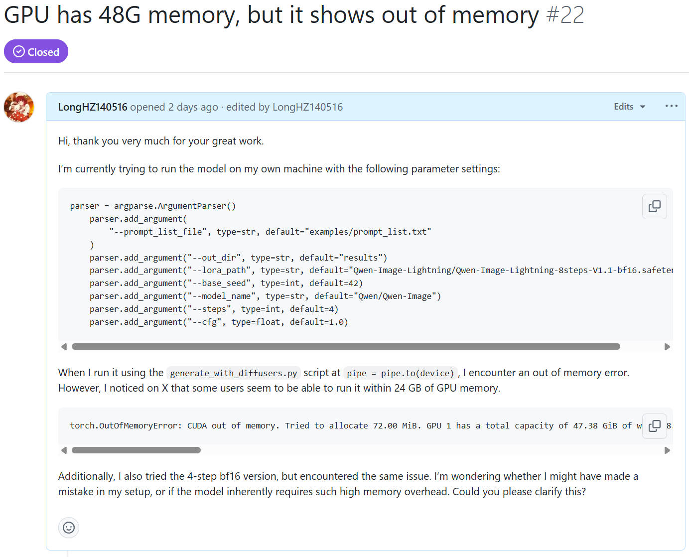

## Introduction

前段时间 [Qwen-Image](https://github.com/QwenLM/Qwen-Image) 和 [Qwen-Image-Edit](https://github.com/QwenLM/Qwen-Image) 出了，有非常强的图像生成能力。但是由于学校的算力资源有限，完全没法跑满血版的 Qwen-Image \ Qwen-Image-Edit 模型。而我在 X 上无意刷到了一个博客说他在ComfyUI运行了一个微调的模型 [Qwen-Image-Lightning](https://github.com/ModelTC/Qwen-Image-Lightning)，需要的显存连16GB都不到。因此我决定尝试一下，但是没想到我本地配置好环境后，在本地48GB的卡上都没法运行。我并不明白是为什么，因此我发了个 [Issue](https://github.com/ModelTC/Qwen-Image-Lightning/issues/22) 问仓库作者是什么原因。后面得到仓库作者回答了，我也调研了一下，顺手写个博客记录一下。

## Reason

* 在本地环境运行的时候，是通过**Diffusers**运行的。而Diffusers一般默认使用的是 ***fp16/bf16*** 两种半精度，无法直接运行 ***fp8*** 这种低精度。
* 在**ComfyUI**环境运行时候，由于ComfyUI本身是一个面向本地部署用户的图形化工作流工具，用户的整体设备可能并没有那么好，因此ComfyUI会支持 ***fp8*** 精度的模型加载方式。此外，Qwen-Lightning 也提供了供ComfyUI用户使用的 ***fp8*** 精度的模型

## Solution

如果我想在本地环境中通过 Diffusers 运行 fp16/bf16 精度的模型，且想降低我显存的消耗应该怎么办呢？

仓库作者给了我一个方式：**通过 offload 的方式对模型进行加载**

这是指什么意思呢？这是 **Diffusers** 库里将 模型/权重卸载到 CPU 或硬盘的一个功能。当我们的 GPU 显存不够时，可以把一部分模型权重或中间缓存转移到 CPU 内存（甚至磁盘），只在需要计算时再加载到 GPU，从而达到降低 GPU 显存占用的目的。

具体信息可以参考HuggingFace官方文档中的 [Reduce memory usage](https://huggingface.co/docs/diffusers/optimization/memory#cpu-offloading) 和 [Compile and offloading quantized models](https://huggingface.co/docs/diffusers/optimization/speed-memory-optims) 两个文档进行学习。

通过这样的方式，我便可以在过程中以每次 GPU 占用在2G内的开销下跑完 Qwen-Image-Lightning-8step 模型的推理，从而解决了无法本地运行的问题。

