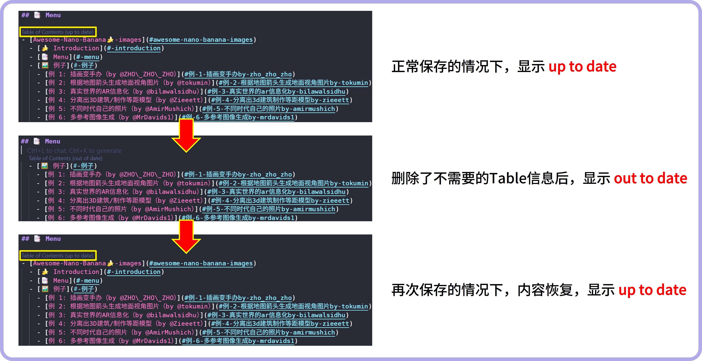
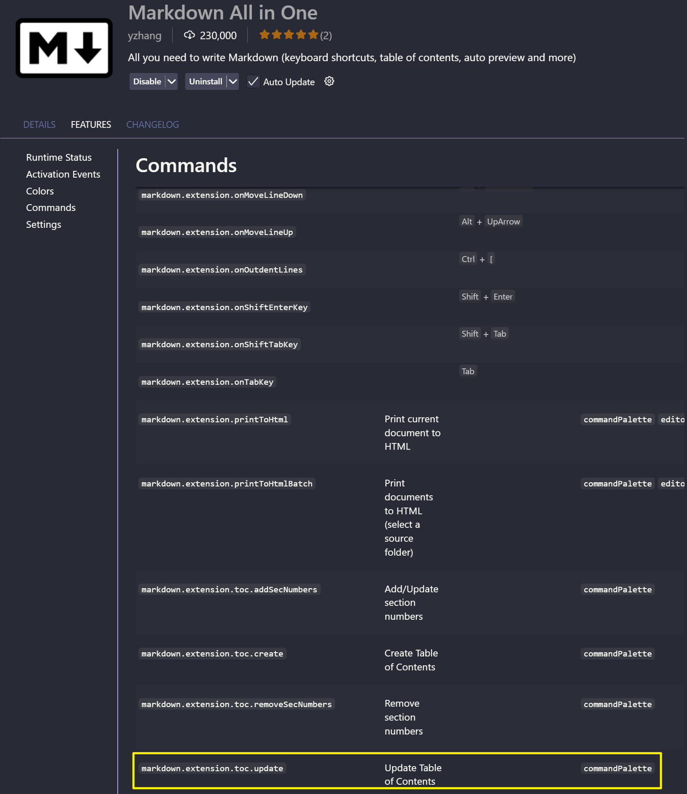
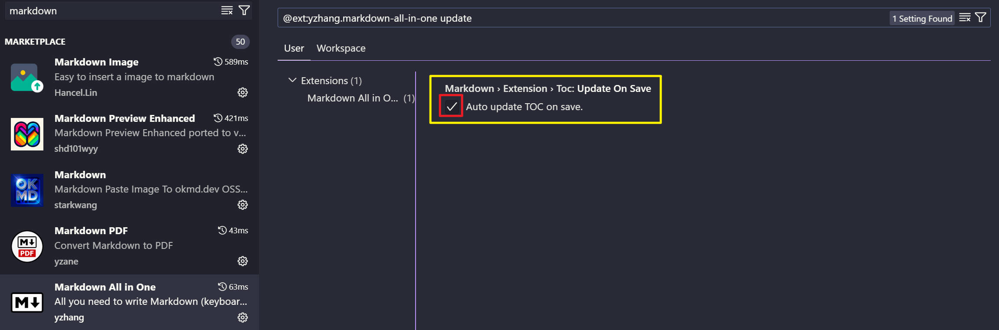

## Introduction

最近做了一个仓库 [Awesome-Nano-Banana-images](https://github.com/PicoTrex/Awesome-Nano-Banana-images)，收集了不少Nano-Banana的使用示例，涨了不少star。不过在收集的过程中，为了让用户能够更加清晰地看到里面包含哪些内容，所以需要做一个menu。在做的过程中遇到了一个非常奇怪的问题，在menu中我想删除case前的信息，但是每次删除后保存它又再次出现了（如下所示）

## Solution

在查找问题的过程中发现是插件 **Markdown All in One** 中的功能导致的，插件中存在一个名为 *markdown.extension.toc.updateOnSave* 的功能，它会在保存的时候自动更新 table of contents，所以导致了上面的问题。

那么，如何解决呢？

非常简单，只需要去 **Markdown All in One** 中的 Setting 处，搜索 *updateOnSave* 将上面的勾选取消即可。后续再删除对应的table信息，保存后也不会进行恢复了。

