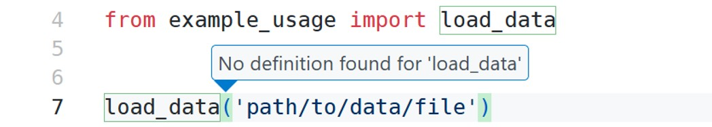
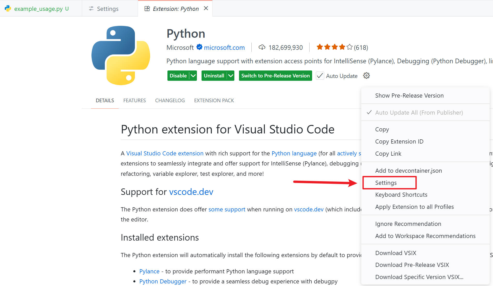
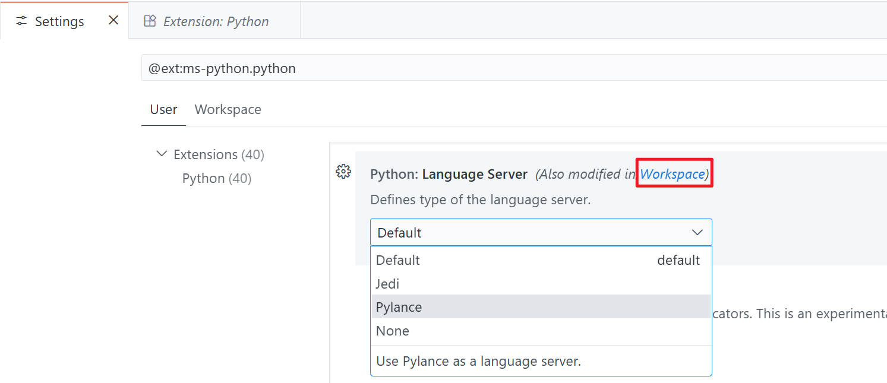
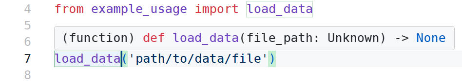

## Introduction

前段时间遇到了一个问题：我import了一个函数，明明路径正确且代码在终端正常运行，但是在IDE界面中却无法访问其定义，哪怕Interpreter是正确的。虽然当前解决了，但是没有记录，结果今天又遇到了，解决方式反而忘了...虽然很简单，不过还是记录一下好。

## Solution

为了大概的记录，我选择新建了一个文件夹写了个函数来演示。虽然遇到的问题往往都是install的package中的函数无法访问定义，不过其实本质差不太多。

从下面的的图片可以看到，当前的函数无法正常访问，尽管函数已经正常定义和使用了，也出现了 `"No definition found for '<function>' "` 的问题。

具体检查和解决步骤如下：

1. 首先在vscode中按下 `Ctrl + Shift + P`，搜索 `Python: Select Interpreter`，选择需要的python解释器 / 也可以直接在vscode右下角的处直接进行选择，需要确保当前的Python 解释器是运行你代码所需要的。
2. 如果选择了合适的解释器也依然有报错，那么需要在 `Extension` 中搜索 `Python`，进入 `Python Settings`。

随后，找到 `Python: Language Server`，将 `Default` 改为 `Pylance` / `Jedi`。记住，需要同时修改 User和 Workspace 处的，不然可能导致问题依然出现。

最后，重新打开刚才的函数，可以看到能够正确访问函数的信息了，问题解决咯。

